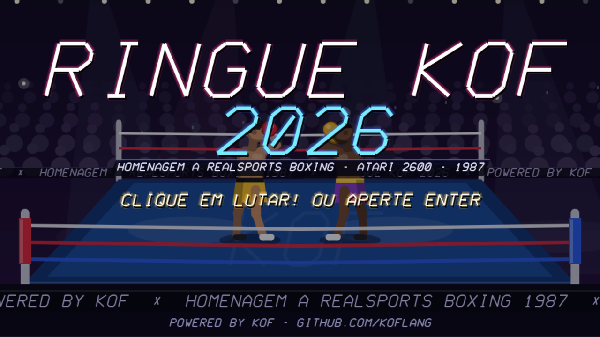
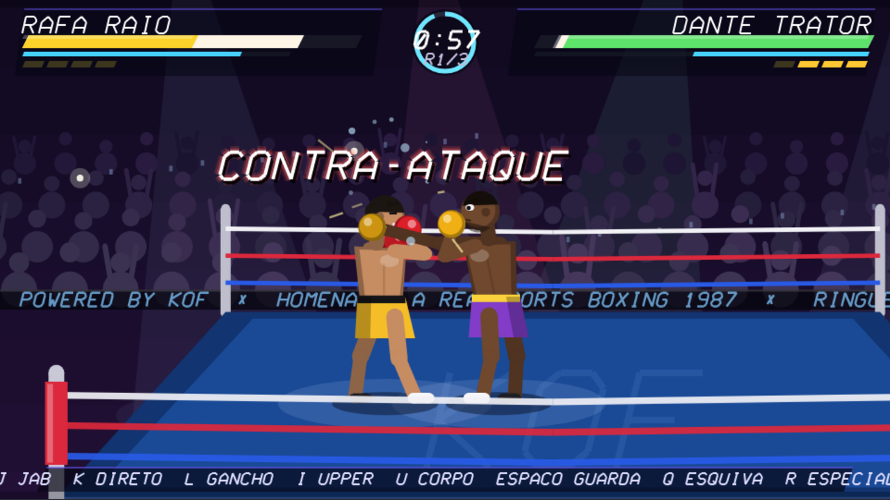
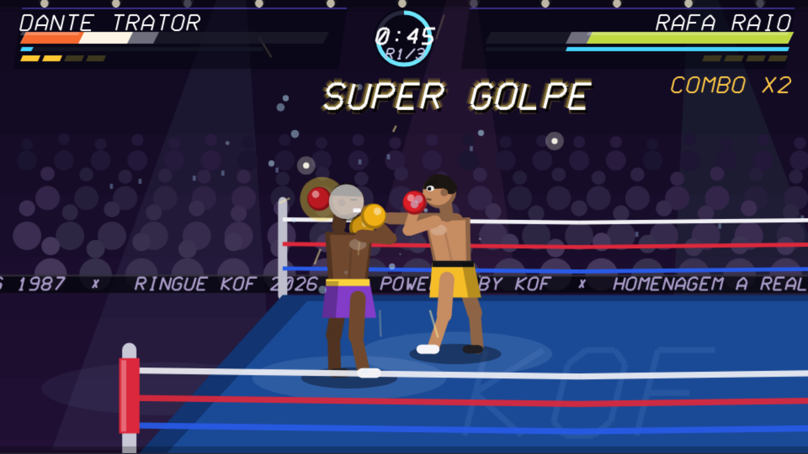
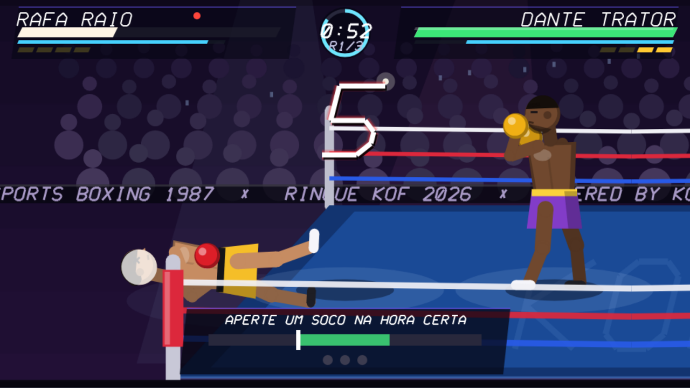
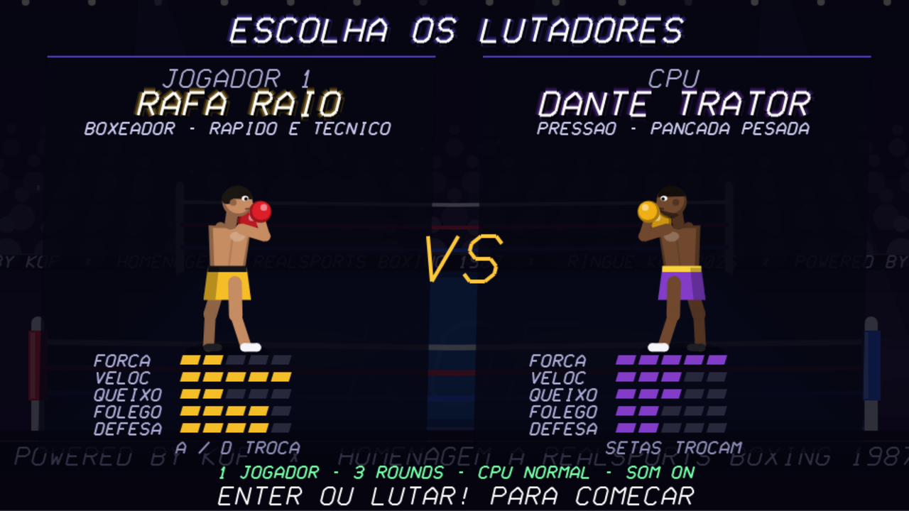
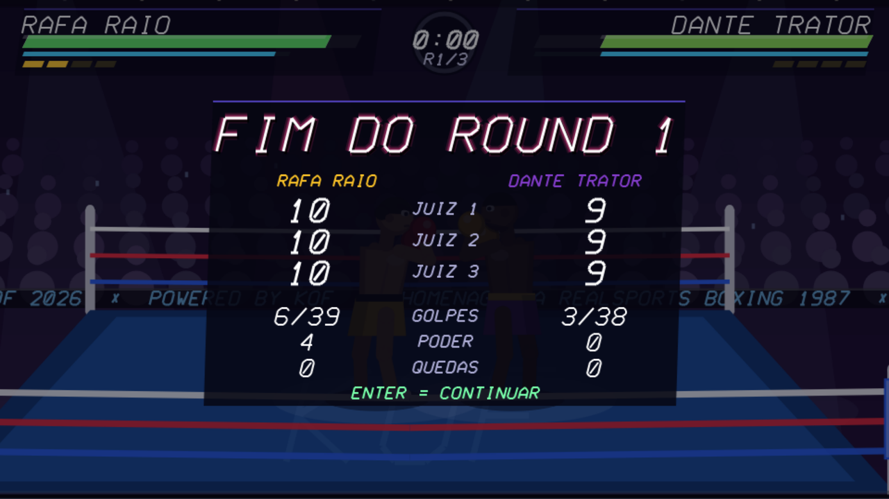

# Ringue KOF 90's 🥊

A continuação do [Ringue KOF 87](https://github.com/PublioSantos/ringue-kof-87),
a homenagem em **Kof** ao RealSports Boxing (Atari 2600, 1987).
Mesma ideia, agora com cara de fliperama dos anos 90: combos, super golpe,
juízes, torcida e trilha sintetizada. Continua tudo escrito em Kof.





| Super golpe | Knockdown e contagem |
|---|---|
|  |  |

| Seleção de lutadores | Cartões dos juízes |
|---|---|
|  |  |

## Jogue online

**[▶ Abrir no navegador](https://publiosatnos.github.io/ringue-kof-90s/web/)**

## Como rodar

Baixe **`ringue-kof-90s.html`** (botão *Download raw file* na página do
arquivo) e abra no navegador: é o jogo inteiro num arquivo só, funciona
offline, sem servidor.

Com o Kof instalado:

```bash
kof run ringue90s.kf --target js     # roda no webview do próprio Kof
kof run ferramentas/empacotar.kf      # junta partes/, compila e gera o HTML único
```

## Como jogar

Clique em **LUTAR!** (ou em qualquer botão): isso ativa o teclado.

| | Jogador 1 | Jogador 2 (modo 2P) |
|---|---|---|
| Andar (lados e profundidade) | W A S D (1P: também setas) | Setas |
| Jab / Direto / Gancho | J / K / L | 1 / 2 / 3 |
| Uppercut / Corpo | I / U | 4 / 5 |
| Guarda (segurar) | Espaço | 0 |
| Esquiva | Q | . |
| Especial (segurar + soco) | R | 6 |

Enter = confirmar · P ou Esc = pausa · N = som · M = música ·
botões na tela para mouse e toque.

## 87 x 90's

| | Ringue KOF 87 | Ringue KOF 90's |
|---|---|---|
| Golpes | 3 (jab, corpo, gancho) | 5, com preparo, impacto e recuperação |
| Defesa | guarda | guarda que pode ser quebrada, esquiva com janela perfeita |
| Ataque | golpes soltos | combos encadeados, contra-ataque, super golpe |
| Energia | uma barra | vida, dano "cinza" que se recupera, fôlego, dano no corpo que reduz o fôlego |
| Queda | apertar botões | contagem do juiz e minijogo de timing para levantar |
| Pontos | contagem de golpes | 3 juízes no sistema 10-9 do boxe; decisão unânime, dividida ou majoritária |
| IA | uma só | 4 estilos, 3 níveis, aprende o seu golpe favorito |
| Visual | pixels 3x5, sem animação | corpo articulado, câmera dinâmica, partículas, câmera lenta |
| Som | onda quadrada 8 bits | síntese em 16 bits: baques, couro, gongo, torcida e trilha synthwave |

## O que tem dentro

**Luta.** Cada golpe tem preparo, quadros ativos e recuperação. Golpes podem
ser encadeados na recuperação do anterior (combo), e acertar quem está
armando um golpe vale contra-ataque (dano x1,5). Para não haver combo
infinito, cada golpe seguido atordoa menos e empurra mais.
A guarda segura golpes na cabeça, mas gasta fôlego e quebra quando o fôlego
acaba; golpes no corpo passam por ela. A **esquiva perfeita** (esquivar no
instante do golpe) ativa câmera lenta e garante um contra-ataque. Acertar
golpes enche a barra de **especial**: cheia, R + soco solta o super golpe.

**Energia.** Parte do dano fica "cinza" e volta devagar se você parar de
apanhar. Golpes no corpo diminuem o fôlego máximo. Cansado, você bate mais
fraco e anda mais devagar.

**Quedas.** No knockdown o juiz conta. A CPU levanta quando tem condições;
você levanta acertando o soco no momento em que o marcador passa pela faixa
verde, três vezes, e a faixa fica menor a cada queda. Três quedas no mesmo
round são nocaute técnico.

**Juízes.** Cada round é pontuado por três juízes no sistema 10-9, com base
em golpes conectados, golpes de poder e dano, cada um com seu "olhar".
Quedas tiram pontos (10-8, 10-7).

**IA.** Quatro estilos: o boxeador mantém distância e circula com jabs; o
tanque avança e aguenta; o contra-golpe espera, esquiva e pune; o "pressão"
encurta a distância e trabalha o corpo. A IA lê o preparo dos seus golpes
com um tempo de reação que depende da dificuldade, e conta os golpes que você
mais usa para defendê-los com mais frequência.

**Gráficos.** Lutadores com esqueleto articulado (cotovelos e joelhos por
cinemática inversa), sombreamento, rosto com expressões, queda e
comemoração animadas. Arena com holofotes, torcida que vibra com a luta,
flashes de celular, painéis de LED rolando e luzes no teto. Câmera que
segue a luta e dá zoom, tremida da tela, pausa no impacto (hit-stop),
câmera lenta, suor e faíscas. Os textos usam uma fonte vetorial em itálico,
desenhada pelo próprio programa.

**Som.** Os 20 sons são sintetizados em Kof na abertura do jogo: osciladores,
ruído filtrado, envelopes e ecos, mixados em WAV PCM 16 bits. O soco é um
baque grave que cai de tom com o estalo do couro; o gongo usa parciais
inarmônicos como um sino de verdade; a torcida tem várias camadas de ruído
pulsando; a trilha é um loop synthwave de 4 compassos (bateria, baixo,
arpejo e acordes).

## Quantas linhas de Kof

| Arquivo | Linhas | Código (sem brancas e comentários) |
|---|---:|---:|
| `partes/01-base.kf` (matemática, desenho, fonte vetorial) | 382 | 309 |
| `partes/02-audio.kf` (síntese e WAV) | 537 | 491 |
| `partes/03-luta.kf` (lutadores, regras, juízes) | 795 | 715 |
| `partes/04-ia-fluxo.kf` (IA, fluxo, controles) | 511 | 466 |
| `partes/05-graficos.kf` (arena, lutadores, partículas) | 497 | 446 |
| `partes/06-telas-main.kf` (HUD, telas, main) | 461 | 421 |
| **`ringue90s.kf`** (as partes juntas) | **3.183** | **2.848** |
| `ferramentas/empacotar.kf` | 125 | 99 |

## Notas técnicas

- **Desempenho.** O runtime JS do Kof serializa a página inteira em HTML
  depois de cada `fill()` e `stroke()` do Canvas. Com centenas de formas por
  quadro, isso derrubava o jogo para menos de 30 quadros por segundo. O
  empacotador (em Kof) remove essa serialização só das funções de desenho do
  runtime embutido no HTML; com isso o jogo roda a 60 quadros por segundo.
- **`&&` sem curto-circuito.** Em algumas condições, o backend JS do Kof
  traduz `a && b` como `a & b`, avaliando os dois lados. O código do jogo
  usa `if`s aninhados onde isso faria diferença.
- **Sem seno no Kof.** O `math` do Kof não tem seno nem cosseno; o jogo monta
  a própria tabela com uma série de Taylor na abertura.

## Créditos

Criado por Públio Santos, com IA, como homenagem. RealSports Boxing é um jogo
da Atari Corp. (1987); este projeto não tem vínculo com a Atari e não usa
nenhum código, gráfico ou som do cartucho original. Os lutadores são
personagens fictícios.

Licença: MIT (uso livre), veja `LICENSE`.

---

Powered by Kof: https://github.com/KofLang
